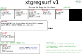
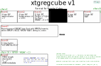
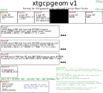
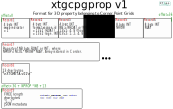
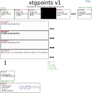

Data model and formats
======================

Here is a description of the internal datamodels used for various datatypes in
XTGeo, and the input/output formats that are supported in the current version.

-----------------------
Surface: RegularSurface
-----------------------

See class :class:`xtgeo.surface.RegularSurface` for details on available
methods and attributes.

A surface can in principle be represented in various ways. Currently, XTGeo
supports a `RegularSurface` which is commonly used in the oil
industry. Due to the regular layout, such surfaces are quite fast to work
with and requires small storage (only the Z values array is stored).

Description
^^^^^^^^^^^

A RegularSurface is described by:

* An origin in UTM coordinates, defined as ``xori`` and ``yori``

* An increment in each direction, defined as ``xinc`` and ``yinc``

* A number of columns and rows, where columns follow X and rows follow Y, if
  a rotation is zero, as ``ncol`` and ``nrow``.

* A ``rotation`` of the X axis; in XTGeo the rotation is counter-clockwise
  from the X (East) axis, in degrees.

* An ``yflip`` indicator. Normally the system is left-handed (with Z axis
  positive down). If yflip is -1, then the map is right-handed.

* A 2D array (masked numpy) of ``values``, for a total of ncol * nrow entries.
  Undefined map nodes are masked. The 2D numpy array is stored in C-order
  (row-major). Default is 64 bit Float.

.. figure:: images/datamodel_regsurface.svg

Within the C code (backend for python functions), arrays are stored in 1D,
C-order and are usually named ``p_map_v`` in the code.

RegularSurface supported import/export formats
^^^^^^^^^^^^^^^^^^^^^^^^^^^^^^^^^^^^^^^^^^^^^^

.. list-table:: RegularSurface format support
   :widths: 20 8 8 20 30
   :header-rows: 1

   * - Data format/source
     - Import
     - Export
     - Format limitations
     - Comment
   * - Irap/RMS Binary
     - Yes
     - Yes
     -
     - This is the default format
   * - Irap/RMS ASCII
     - Yes
     - Yes
     -
     -
   * - IJXYZ OW)
     - Yes
     - Yes
     -
     - 5 columns: I, J, X, Y, Z
   * - ZMAP+ ASCII
     - No
     - Yes
     - No map rotation
     - Output auto derotated
   * - Petromod binary pmd
     - Yes
     - Yes
     -
     -
   * - Storm binary
     - No
     - Yes
     - No map rotation
     - Output auto derotated
   * - Inside RMS (ROXAPI)
     - Yes
     - Yes
     -
     -

---------
Cube data
---------

A Cube is described by:

* An origin in UTM coordinates, defined as ``xori``, ``yori`` and ``zori``

* An increment in each direction, defined as ``xinc``, ``yinc`` and ``zinc``

* A number of columns, rows and layers, where columns follow X and rows follow Y, if
  a rotation is zero, as ``ncol`` and ``nrow``. Vertically ``nlay``

* A ``rotation`` of the X axis; in XTGeo the rotation is counter-clockwise
  from the X (East) axis, in degrees.

* An ``yflip`` indicator. Normally the system is left-handed (with Z axis
  positive down). If yflip is -1, then the cube is right-handed.

* A 3D array (numpy) of ``values``, for a total of ncol * nrow * nlay entries.
  All nodes are defined. The 3D numpy array is stored in C-order
  (row-major). Default is 32 bit Float.

Within the C code (backend for python functions), arrays are stored in 1D,
C-order and are usually named ``p_cube_v`` in the code.

Description of cubes
^^^^^^^^^^^^^^^^^^^^

Cubes are quite similar to maps, only that a third dimension is added.

Cube supported import/export formats
^^^^^^^^^^^^^^^^^^^^^^^^^^^^^^^^^^^^

.. list-table:: Cube format support
   :widths: 20 8 8 20 30
   :header-rows: 1

   * - Data format/source
     - Import
     - Export
     - Format limitations
     - Comment
   * - SEGY
     - Yes
     - Yes
     -
     - Export: ASCII not EBDIC
   * - RMS regular grid
     - Yes
     - Yes
     -
     -
   * - Storm regular grid
     - Yes
     - No
     -
     -
   * - Inside RMS, ROXAPI
     - Yes
     - Yes
     -
     -

----------------------
3D Grid and properties
----------------------

A 3D grid consists of two parts, a geometry which follows a simplified version of
a corner-point grid (Grid class), and a number of assosiated properties
(GridProperty class):

* The geometry is stored as numpy arrays; but currently the geometry itself is not
  directly accessible in Python. The corresponding C arrays are usually named
  coordsv, zcornsv, and actnumsv. They are one dimensionial arrays in internal
  _xtgformat=1, or multidimensional arrays in xtgformat=2 (details on demand).

* The grid dimensions are given by ``ncol * nrow * nlay``

* The properties are stored as 3D masked numpy arrays in python. Undefined cells are
  masked. The machine order in python is C-order. For historical reasons, the memory
  order of the property arrays in C code (when applied) is F-order for _xtgformat=1,
  while _xtgformat=2 uses C order.

Description of 3D grid formats
^^^^^^^^^^^^^^^^^^^^^^^^^^^^^^

In prep.

Supported import/export formats
^^^^^^^^^^^^^^^^^^^^^^^^^^^^^^^

.. list-table:: 3D grid geometry format support
   :widths: 20 8 8 20 30
   :header-rows: 1

   * - Data format/source
     - Import
     - Export
     - Format limitations
     - Comment
   * - ROFF binary
     - Yes
     - Yes
     -
     - Default
   * - ROFF ASCII
     - No
     - Yes
     -
     -
   * - XTGeo binary
     - Yes
     - Yes
     -
     - Fast binary format that allows metadata
   * - Eclipse ASCII GRDECL
     - Yes
     - Yes
     -
     -
   * - Eclipse binary GRDECL
     - Yes
     - Yes
     -
     -
   * - Eclipse EGRID
     - Yes
     - Yes
     -
     -
   * - Eclipse GRID
     - No
     - No
     -
     - Rarely applied nowadays?
   * - Pandas dataframes
     - No
     - Yes
     -
     - Indirect CSV format
   * - Inside RMS, ROXAPI
     - Yes
     - Yes §
     -
     - § Improved in RMS 11.1

The Pandas dataframe format is limited in the sense that only centerpoint
coordinates are applied.

.. list-table:: 3D grid property format support
   :widths: 20 8 8 20 30
   :header-rows: 1

   * - Data format/source
     - Import
     - Export
     - Format limitations
     - Comment
   * - ROFF binary
     - Yes
     - Yes
     -
     - Default
   * - ROFF ASCII
     - No
     - Yes
     -
     -
   * - Ecl ASCII GRDECL
     - Yes
     - Yes
     - Discrete coding missing
     -
   * - Ecl binary GRDECL
     - Yes
     - Yes
     - Discrete coding missing
     -
   * - Ecl bin INIT, UNRST
     - Yes
     - No
     - Discrete coding missing
     -
   * - Pandas dataframes
     - No
     - Yes
     -
     - Indirect CSV format
   * - Inside RMS, ROXAPI
     - Yes
     - Yes
     -
     -

---------
Well data
---------

Well data is stored in python as Pandas dataframe plus some additional
metadata.

A special subclass is Blocked Well data.

Well data supported import/export formats
^^^^^^^^^^^^^^^^^^^^^^^^^^^^^^^^^^^^^^^^^

In prep.

-----------------------------
XYZ data, Points and Polygons
-----------------------------

In general, Points and Polygons are XYZ data with possible atttributes.

Points and Polygons data is stored in python as Pandas dataframe plus some additional
metadata.

The term "Polygons" here is not precise perhaps, at it refers to connected lines which
can either form an open polyline or are closed polygon. A Polygons() instance may
have a number of individual polygon "pieces", which are defined by
a ``POLY_ID`` (default name) column. This design is borrowed from RMS.

XYZ data supported import/export formats
^^^^^^^^^^^^^^^^^^^^^^^^^^^^^^^^^^^^^^^^

In prep.

--------------------
XTGeo binary formats
--------------------

.. warning:: The following is experimental and under construction!

XTGeo is developing its own binary data storage due to limitations in existing systems.
Examples of such limitions are:

* Most important, a **general lack of support for metadata**, where metadata shall
  both have mandatory and optional members

* Surface format such as Irap binary are based on Fortran schemes and need byte
  swapping for each number on little endian CPU's.

* Cube data: SEGY format is a complex, old and difficult format, for the purpose
  of Cube data in XTGeo

* 3D grid data: There is no existing format that handles named subgrids

* Efficient data structures for read and write

* Lack of open sourcing

XTGeo general binary layout
^^^^^^^^^^^^^^^^^^^^^^^^^^^

As first principle xtgeo formats shall be open-source and well documented.
The general the xtgeo binary formats will using this design:

* First a 4 byte INT which shall be equal to 1. If 1 is not read, try byte swapping
  and re-read. If still not the value 1, then file is invalid.

* Next a "magic" 4 byte describing the format version:
  * Series starting with 1100 are surface formats
  * Series starting with 1200 are cube formats
  * etc...

* Next a set of numbers that shall describe the following arrays as cheap as possible
  This will vary somewhat across data types.

* Then the arrays are stored, in general using C-order layout for multidimensional
  data.

* Then the 13 letter word ``\nXTGMETA.v01\n`` will present, where ``\n`` is newline.

* Finanally a JSON text dump will be present, to define the metadata. This JSON
  will have a set of first level keys, where the key ``_required_`` shall always be
  present, and the key ``_optional_`` will usually be present. Both
  ``_required_`` and ``_optional_`` will a have a strict set of valid subkeys.
  Then a set of ``_freeform_`` keys may be added.

* It should be possible to change/edit the metadata for ``_optional_`` and the
  freeform keys.

Note that this structure allows reading the first initial numbers and then use
``seek`` functions in e.g. C or Python to jump directly to the JSON metadata.

RegularSurface format version 1
^^^^^^^^^^^^^^^^^^^^^^^^^^^^^^^

A RegularSurface is a regular mesh in 2D usually describing a horizon or a property.

The file extension shall be: ``.xtgregsurf``

The format specification is:

Record 1:
  An 4 byte integer. This integer is an "endian" indicator and will read as 1
  if no bytewap is required.

Record 2:
  An 4 byte integer which shall read 1101, indicating RegularSurface format v.1.

Record 3:
  An 4 byte integer which shall read 4 or 8, hinting of the data array is
  4 byte Float, and 8 byte Float.

Record 4:
  A 8 byte INT (LONG) which is the number of columns (NCOL) in the map.

Record 5:
  A 8 byte INT (LONG) which is the number of rows (NROW) in the map.

Record 6:
  An array with length and byte-size given in records 3, 4 and 5. Ordering shall be C
  order.

Record 7:
  The 13 letter word ``\nXTGMETA.v01\n`` will present, where ``\n`` is newline.

Record 8:
  The JSON dump describing the data. Example:

.. code-block:: JSON

    {
      "_required_": {
        "ncol": 123,
        "nrow": 323,
        "xori": 445566.0,
        "yori": 5777662.0,
        "xinc": 20.0,
        "yinc": 40.0,
        "yflip": 1,
        "rotation": 30.0,
        "undef": 1e+32,
      },
      "_optional_": {
        "domain": "depth",
        "units": "metric",
        "name": "Top Whatever"
      },
      "_freeform_": {
          "smda": {
          "freekey1": "freevalue"
          }
      }
    }

.. https://onlineyamltools.com/convert-yaml-to-json

Regular Cube format version 1
^^^^^^^^^^^^^^^^^^^^^^^^^^^^^^^

XTGeo 3D grid geometry format
^^^^^^^^^^^^^^^^^^^^^^^^^^^^^

XTGeo 3D grid property format
^^^^^^^^^^^^^^^^^^^^^^^^^^^^^

XTGeo XYZ points with attributes format
^^^^^^^^^^^^^^^^^^^^^^^^^^^^^^^^^^^^^^^

XTGeo layout for other data types
^^^^^^^^^^^^^^^^^^^^^^^^^^^^^^^^^

In prep.

Speed and file size comparison of xtg vs other formats
^^^^^^^^^^^^^^^^^^^^^^^^^^^^^^^^^^^^^^^^^^^^^^^^^^^^^^

.. list-table:: Speed and size comparisons
   :widths: 10 10 6 6 6 20
   :header-rows: 1

   * - XTGformat
     - Other
     - Imp gain
     - Exp gain
     - Fsize ratio
     - Comment
   * - xtgregsurf
     - Irap binary
     - 2.5
     - 2.9
     - 99%
     - XTG faster, same size
   * - xtgregcube
     - Seg-Y
     - 3.0
     - 28.0
     - 54%
     - XTG much faster and less size.
   * - xtgcpgeom
     - Roff binary
     - 12.6
     - 7.0
     - 210%
     - XTG much faster but bigger size.
   * - xtgcpprop
     - Roff binary
     - 8.5
     - 7.5
     - 100%
     - XTG much faster, same size.
