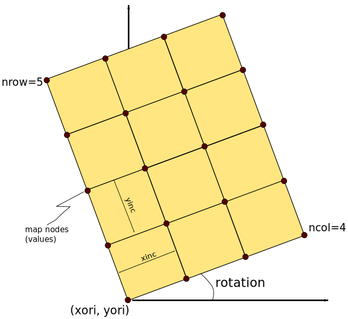

.. highlight:: python

=================
XTGeo data models
=================

Here is a description of the internal datamodels used for various datatypes in
XTGeo.

-----------------------
Surface: RegularSurface
-----------------------

See class :class:`xtgeo.RegularSurface` for details on available methods and
attributes.

A surface can in principle be represented in various ways. Currently, XTGeo
supports a `RegularSurface` which is commonly used in the oil
industry. Due to the regular layout, such surfaces are quite fast to work
with and requires minimum storage.

In principle, a RegularSurface is described by:

* An origin in UTM coordinates, defined as ``xori`` and ``yori``

* An increment in each direction, defined as ``xinc`` and ``yinc``

* A number of columns and rows, where columns follow X and rows follow Y, if
  a rotation is zero, as ``ncol`` and ``nrow``.

* A ``rotation`` of the X axis; in XTGeo the rotation is counter-clockwise fraom the X
  (East) axis, in degrees.

* An ``yflip`` indicator. Normally the system is left-handed (with Z axis positive down).
  If yflip is -1, then the map is right-handed (Z axis still positive down)

* A 2D array (masked numpy) of ``values``, for a total of ncol * nrow entries. Undefined
  map nodes are masked. The 2D array is stored in C-order (row-major). Default is 64 bit Float.

Within the C code (backend for python functions), arrays are stored in 1D, C-order and is usually
named ``p_map_v`` in the code.

---------
Cube data
---------
