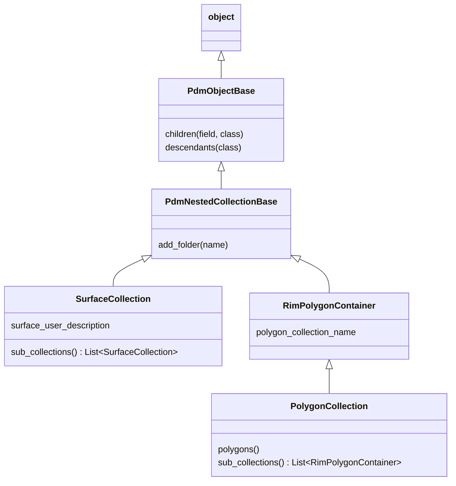
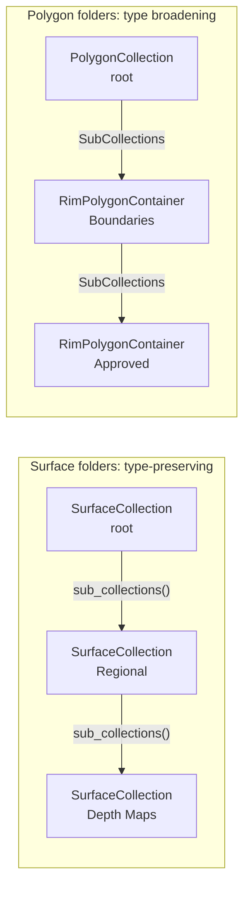

# ResInsight Class Hierarchies

## Python Inheritance



## Traversal Shapes



The crucial point is:

```text
PolygonCollection is-a RimPolygonContainer
RimPolygonContainer contains RimPolygonContainer children
```

Thus a `PolygonCollection` root satisfies the container interface, but traversing
into it produces the broader `RimPolygonContainer` type. Surfaces do not broaden:
every level remains `SurfaceCollection`.

This is what the adapters encode in
[`_resinsight_base.py`](src/xtgeo/interfaces/resinsight/_resinsight_base.py#L62)
and
[`_resinsight_base.py`](src/xtgeo/interfaces/resinsight/_resinsight_base.py#L85).


Sources: [PolygonCollection](https://api.resinsight.org/en/main/api/rips.PolygonCollection.html),
[RimPolygonContainer](https://api.resinsight.org/en/main/api/rips.RimPolygonContainer.html),
and [SurfaceCollection](https://api.resinsight.org/en/main/api/rips.SurfaceCollection.html).